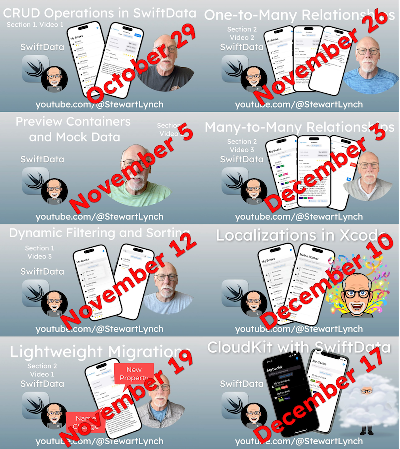

# MyBooks

This is the repository for the SwiftData series on YouTube.

Videos are released on a weekly basis starting October 29 and ending on December 17

You can get early access by purchasing a single $5 ko-fi for my at https://ko-fi.com/StewartLynch any time up until November 5.  After that, if you want early access to these videos and all of my other videos as they are completed, you can become a monthly subscriber.

Select the branch corresponding the the video to download the completed source code for that video.

If you want to work along starting at one of the videos, download the branch from the previous video and start from there.

